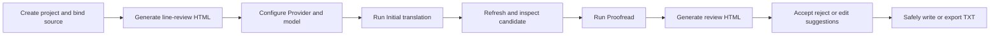

# YN Translation Workshop 2.0

A local workbench that brings human line editing, project assets, full AI translation, full AI proofreading, and remote operation into one application.

You can keep the Agent disabled and use only the line-by-line web frontend, or let the built-in Harness divide a complete translation or proofreading run across Workers. Mechanical validation, independent review, and Host completion gates run before you approve the result.

[中文](README.md) · [Complete guide and technical manual](https://tohman233.github.io/YN-translation-workshop/) · [Download 2.0.4](https://github.com/TohmaN233/YN-translation-workshop/releases/tag/v2.0.4)

## 2.0.4

- Proofread workers keep valid findings from a batch write and return only rejected no-ops for rewrite.
- Applying proposals no longer resets a card from 人工修改 back to accepted or clears the handwritten suggestion.
- Background glossary sync no longer overwrites statuses such as TXT written.

## 2.0.3

- Proofread wrap-up is now Host-owned: bound line numbers fill source/current text, an empty write cannot wipe child findings, and the parent can read Pi session JSONL to recover child artifacts before finalize.
- An expired Grok OAuth token replaces only that worker; `resumeYnWorkflow` no longer needs a second consent gate; Host user-gates stop the parent loop instead of retrying the same tool.
- Long glossary names cover short ones, character `requiredTerms` apply only to attributed quoted speech, mutation alignment pages batch up to 24 lines, and leftover warnings ask before review.

## 2.0.2

- Fixed complete-translation takeover: accepted staging no longer waits for the whole batch to settle before entering the canonical file. A formal parent takeover now promotes the hash-current staging range immediately and releases that write lock, so the parent can read the draft and repair only rejected lines.
- Alignment row reads now use the audit's own candidate path instead of hashing against an empty canonical file.
- Browsing `translation-staging` with project file tools returns an explicit Host-owned redirect error instead of empty hits.

## 2.0.1

- Fixed EPUB proofreading using the wrong translation path. A hand-picked frontend translation file wins; if the HTML later binds `translated` and the page never chose one, the binding updates automatically so Host does not get stuck on a temporary snapshot.
- Added **Grok (OAuth)** to model selection. Sign in with SuperGrok / X Premium+ or import `~/.grok/auth.json`. This stays separate from the xAI API-key provider and does not fall back to a key on OAuth failure.
- Raised the provider-stream inactivity limit to 3000 seconds. Grok, unlike GPT, finishes thinking before writing; the previous wait was too short.

## What 2.0 is

In 2.0, a workflow is not a prefilled prompt. It is an executable path backed by the Pi Agent runtime, YN Host, constrained Functions, durable state, artifact validators, and completion gates. The product exposes exactly two complete Workflows:

1. **Initial translation** produces a strictly line-aligned candidate, mechanically validates and independently reviews every chunk, repairs exact failures, and promotes accepted output.
2. **Proofread** scans every aligned row first, runs complete split review or stratified semantic sampling, and produces one Findings JSON plus a visual review page.

Terminology consistency, character voice, existing-translation reuse, and final QA are capabilities inside those Workflows. Models, Providers, Agent sessions, and concurrency are configured directly in the application.

## Download

- Windows installer: `translation-workshop-Setup-2.0.4-x64.exe`
- Windows portable build: `translation-workshop-Portable-2.0.4-x64.exe`
- Checksums: `SHA256SUMS.txt`

The installed build can check for updates and restart into the downloaded installer. The portable build opens the Release page when an update is available.

## Complete feature list

### 1. Projects, inputs, and bindings

- Create, load, save, and switch isolated projects. Settings, workflow state, assets, and sessions live under each project's `.translation-workshop/` directory.
- The recent-project pointer follows the project actually opened or saved.
- Supports one TXT file, TXT folders, one EPUB, and adjacent-line bilingual TXT / EPUB.
- EPUB becomes UTF-8 working text; ruby extraction keeps base text only, while the original EPUB remains export and repack metadata.
- Separate-file mode binds source and translation independently. Bilingual mode assigns the first or second adjacent position to each language.
- Folder mode matches source and translation documents and maintains one authoritative batch index.
- Ordered folder stages support barriers. `A, {B, C}, D` completes A, runs B/C in parallel, then starts D.
- Translation and report outputs rebind to the current project's `AI_translation/` and `report/` directories when projects change.
- One canonical chunk size drives translation and proofreading. Translation and review Worker counts are ceilings that shrink to actual demand.
- Custom preserve rules protect variables, event codes, tags, control codes, and other immutable payloads. Invalid regular expressions fail visibly.
- Chinese/English UI, HTML themes, a project Agent-proxy switch, and persistent project settings.

### 2. Line-by-line translation and review frontend

- A complete manual workflow from reading and row editing through search and safe write-back, with no Agent required.
- Single-file pages and folder indexes with one canonical child HTML / sidecar identity per batch document.
- Aligned source and translation rows, direct candidate editing, human-edit state, and disk refresh.
- Pagination, page jump, full-text search, scroll restoration, last-focused-row location, and file tabs.
- Issue severity, row highlighting, explicit clearing, read-only mechanical evidence, and ignore handling.
- Ask the Agent about bounded context from a selected row without loading the whole document into chat.
- Accept, reject, or manually edit actionable proofreading suggestions.
- Apply accepted proposals in one action and synchronize every canonical child in a folder batch.
- Export TXT or write to the bound translation after binding, baseline, sidecar, line-count, and conflict checks.
- Timestamped backups before overwrite. Source files are always read-only.
- Legacy HTML upgrades through explicit protocol markers when opened; users do not need to regenerate every page.

### 3. Terminology, characters, style, and memory

- **Approved glossary**: the project's canonical glossary. A selected external glossary remains authoritative for overlapping terms while nonconflicting canonical entries stay available. Importing accepted candidates consolidates the existing canonical glossary, the external glossary, and the candidates; conflicts reject the whole operation, and only a successful merge switches the project binding to canonical.
- **Glossary candidates**: evidence-backed names, targets, and aliases discovered only inside a Worker's owned rows.
- **Character bible**: reusable names, gender, pronouns, forms of address, relationships, and voice facts.
- **Style guide**: title-level tone, expression, and formatting constraints.
- **Translation memory**: search across accepted source/translation segments.
- Glossary input supports JSON, Tab, `=>`, `->`, `=`, and comma-separated records.
- The line-review page can edit terms, search and replace target matches, and import candidates.
- Each assignment receives only directly matched full structured records. Missing ambiguity uses exact-term search.
- Disabling candidate collection blocks new discoveries but keeps existing candidates readable.
- Competing targets close the new-assignment claim gate. After the Parent decides, the Host rescans the full current manifest and prioritizes every affected row.
- Candidate assets, character facts, DomainRun state, and Host persistence commit or roll back together.

### 4. Models, Providers, and Agent sessions

- ChatGPT, Claude, and Grok OAuth, plus OpenAI-compatible APIs, API keys, and explicit model catalogs.
- Provider, OAuth profile, selected model, and default thinking level are user-level settings shared across projects.
- Agent proxying is off by default and is used only when explicitly enabled for the current project.
- Session list, session creation and switching, a separate Agent window, streaming output, and Markdown rendering.
- Thinking, Function calls, and subagents appear as structured conversation blocks rather than leaked protocol text.
- Image attachments appear only when the selected catalog model advertises image input.
- Input, output, cache-token, and estimated-cost telemetry; product-backed commands include `/compact`, copy, Provider settings, and new session.
- Send Steer while work is active and queue Follow-up after it settles. Stop terminates active runtimes and Worker pools.
- Parent and Child use the same Pi Agent runtime, `AgentMessage[]`, and Pi JSONL sessions.
- Long sessions use native Pi compaction. Full Child conversations stay in Child JSONL; the Parent stores only lightweight state and a session reference.

### 5. Full initial-translation Workflow

- The Parent reads current interface bindings and Host state, chooses real concurrency within the project ceiling, and owns final consolidation.
- The Host plans real debt from the authoritative manifest, file stages, canonical chunk size, reuse mask, and accepted evidence. The model cannot invent documents or ranges.
- Persistent translation Workers dynamically claim non-overlapping assignments, avoiding long per-file private queues.
- Each assignment owns only exact writable lines. Bounded adjacent context can be read without expanding write ownership.
- Translation first enters Host-managed staging, whose path, hash, and pending-review state are persisted immediately.
- Mandatory line-count, blank-line, placeholder, tag, control-code, custom-preserve, and line-identity validation.
- A separate read-only review pool checks every mechanical-risk row and stable samples of normal rows.
- Review returns only exact failures and short executable instructions. Passing rows do not generate per-line prose.
- Failures return to the same translation Worker for bounded exact repair instead of restarting a whole chunk.
- No progress or exhausted repair hands hash-current staging and exact failed rows to the Parent while preserving accepted rows and evidence.
- Terminology conflicts become a priority repair wave inside the same batch. Normal claims cannot pass an active priority wave.
- One full-artifact mechanical validation runs after all assignments. Remaining warnings receive paired Parent semantic checks.
- Only true-positive warnings become exact repair debt. False positives persist as hash-bound evidence.
- Stop, crash, and restart recover from durable staging, ownership, evidence, and Pi sessions.

### 6. Existing-translation audit and selective reuse

- Reuse is off by default. Before the first full-run write, the Host creates a SHA-256 backup and clears the old candidate once.
- When enabled, mechanical screening covers every aligned row. Line-count, blank-line, placeholder, tag, and obvious placeholder-text failures go directly to retranslation.
- Wrong language, source copying, abnormal length, repeated targets, AI contamination, and asset signals are risk evidence, not automatic rejection.
- Low-risk aligned target-language rows are reused automatically. Only sparse high-risk rows enter read-only semantic audit.
- Audit returns only `reuse` or `retranslate` and does not spend another model turn restating counts.
- One batch-level user decision transactionally retains accepted rows and clears retranslation rows.
- The later queue contains only real retranslation debt. Retained rows are not resent to make coverage contiguous.
- Cold recovery binds owner, document, source hash, and retained baseline, so output written by the current run is not mistaken for old input.

### 7. Full proofreading Workflow

- Before any semantic Worker starts, the Host runs deterministic H3/H4/H7/H8/H9 scans over all aligned rows in every manifest document.
- Evidence binds source, candidate, glossary, character-bible, and style hashes. Any input change invalidates stale evidence.
- Deterministic signals are evidence for contextual judgment, not automatic findings.
- **Split review** semantically checks every owned row. Chunk size is only a dispatch and persistence boundary.
- **Monte Carlo** uses Host-planned, non-overlapping HOT / WARM / COLD strata with real coverage tracking.
- After minimum rounds, convergence requires two consecutive rounds with no new findings. At the round limit, the user can add three rounds, switch to HOT split review, or stop with current results.
- Proofread Workers are read-only and may submit only evidence-bound structured findings and proper-name candidates.
- Folder mode prescans all files before entering one cross-file staged assignment queue.
- Findings replace their scope atomically and deduplicate. Each requires a global row, category, evidence, and complete replacement line.
- No-op fixes, out-of-range rows, routine target-language punctuation differences, and malformed submissions are rejected.
- Single-file and folder runs persist exactly one Findings JSON. The product renders human review HTML from that JSON.

### 8. Harness, Host, and reliability

- **Runtime** owns model calls, Function calls, continuation, Steer / Follow-up queues, Provider retry, and compaction.
- **Harness** assembles runtime, system prompt, Function set, durable state, and completion conditions into a continuing Agent environment.
- **Host** owns manifests, assignments, stages, write ownership, locks, hashes, validators, transactions, and completion gates.
- General investigation, local repair, full translation, and full proofreading use different typed operation scopes.
- Complete batches reserve atomically before Workers start. Duplicate active batches fail before model runtime creation.
- Parent and Child may read required references, but only Host-granted document, range, or exact-line ownership can write artifacts.
- Staging promotion, domain revision, alignment evidence, and Host JSONL persistence form one rollback-capable transaction boundary.
- Function failure returns to the same Pi turn or becomes explicit Parent repair / resume state. It is not swallowed or reported as success.
- A workflow completes only when the Host settles tasks, repair debt, evidence, artifacts, and final validation.
- Critical phases, Workers, assignments, Provider errors, staging, and hashes remain observable and durable.

#### Why it is stable

- Models perform semantic work; deterministic Host code controls identity, scope, concurrent writes, and completion.
- Partial output stays in staging instead of overwriting the canonical artifact.
- Translation and independent review use separate pools. Failures return precisely, and no-progress retries stop.
- Recovery evidence binds current content hashes. Stale grants and stale evidence cannot remain active.
- Shared-asset updates and artifact promotion are transactional and roll back to a recoverable state.

#### Why it saves tokens

- Host code plans chunks and risk scans instead of asking a model to reread whole files and plan them.
- Assignments receive directly matched assets and short context; missing terms use exact search.
- Mechanical screening, placeholders, line counts, and deterministic proofreading signals consume no model reasoning.
- Independent review reports failures only and produces no per-line explanation for accepted rows.
- The Parent never embeds full Child transcripts; it reads lightweight state and structured discoveries.
- Existing-translation reuse sends only sparse risky rows to semantic audit.
- Hash-bound acceptance and warning evidence survive unrelated edits, avoiding full-document rereview.

### 9. Web and local references

- The Agent can read explicitly supplied HTTP(S) pages and cache readable content.
- Wikipedia uses the MediaWiki API. Ordinary pages use main-content extraction.
- Parent and Children reuse cached references instead of redownloading them for every assignment.
- Explicit absolute paths outside the project, old translations, and backups may be read as references.
- All artifact writes remain bound to project identity and exact Host ownership.

### 10. LAN and remote operation

- Open a work HTML in the desktop app, start LAN sync, and choose a six-digit PIN.
- Phones, tablets, and other computers can open folder indexes and single-file pages.
- Remote users can search, page, edit translations, accept or reject proposals, synchronize pages, and use the Agent panel.
- Remote Prompt, Steer, and Follow-up use the desktop's same durable Pi session rather than a separate remote transcript.
- SSE provides low-latency display only. After disconnects or proxy buffering, the browser converges from canonical Pi messages.
- The desktop app must remain running. LAN exposes the current shared work session, not arbitrary directory browsing.
- Public tunneling is not built in. Cloudflare Tunnel, ngrok, or a similar tool can target the displayed local address.
- A public URL exposes the workbench entry point. Use an unguessable PIN, never publish the URL, and stop both tunnel and LAN sync when finished.

### 11. Updates, recovery, and compatibility

- Installed builds can check GitHub Releases, download updates, and restart into installation. Portable builds open the release download.
- Legacy line-review HTML, proposal HTML, and project fields have explicit upgrade paths.
- Legacy chunk settings are read once during migration and then replaced by the canonical setting.
- Stop terminates active runtimes while preserving hash-current staging, review evidence, and unfinished debt.
- Explicit resume continues the same Pi session and Host batch rather than starting a fake replacement run.
- Provider transport failures preserve redacted cause, Provider, model, session, and retry records for diagnosis.

## Agent Function index

Ordinary users do not need to call these Functions manually. They are the constrained operation surfaces supplied by the Harness. Shared read-only names appear in both roles, producing **52 unique names and 55 callable surfaces**. Parameters, reads, writes, rejection conditions, and next actions are indexed in the [technical Function Registry](https://tohman233.github.io/YN-translation-workshop/functions.html).

<details>
<summary><strong>Parent Functions (38)</strong></summary>

| Area | Functions |
| --- | --- |
| Workflow control | `resumeYnWorkflow` |
| Shared assets | `readTranslationDiscoveries`, `resolveTranslationDiscoveries` |
| Current interface | `readYnInterfaceContext` |
| Local proofreading | `inspectProofreadRange`, `recordProofreadParentReview` |
| Web reference | `fetchWebReference` |
| Project context | `inspectTranslationContext`, `selectSourceDocument` |
| Existing translation | `prepareTranslationReuseAudit`, `readTranslationReuseAudit`, `recordTranslationReuseAudit`, `runTranslationReuseAudit`, `applyTranslationReuseDecision` |
| Models and Children | `listAvailableModels`, `inspectSubagents`, `steerSubagent` |
| Files and search | `readSourceLines`, `readTranslationLines`, `readProjectFile`, `listProjectDir`, `searchProjectText`, `searchTranslationMemory` |
| Warnings and alignment | `readTranslationAlignmentRows`, `inspectTranslationWarnings`, `recordTranslationWarningChecks`, `inspectTranslationAlignment`, `recordTranslationAlignmentChecks` |
| Translation artifacts | `writeProjectFile`, `writeTranslationChunk`, `validateTranslationArtifact` |
| Proofread artifacts | `writeProofreadFindings`, `resolveProofreadGlossaryCandidates`, `finalizeProofreadReport`, `resolveProofreadMontecarloLimit` |
| Scheduling | `runProofreadSubagents`, `runSubagents`, `runTranslationSubagents` |

</details>

<details>
<summary><strong>Child Functions (17)</strong></summary>

| Role | Functions |
| --- | --- |
| General read-only | `listProjectDir`, `searchProjectText`, `readProjectFile` |
| Translation Worker | `readTranslationContext`, `readAssignedSource`, `writeAssignedTranslation`, `repairAssignedTranslation`, `validateAssignedTranslation` |
| Proofread Worker | `readAssignedProofreadContext`, `readProofreadReference`, `writeAssignedFindings` |
| Local delegation | `readBoundSourceLines`, `readBoundTranslationLines` |
| Independent translation review | `readAssignedTranslationReview`, `submitTranslationReview` |
| Existing-translation audit | `readAssignedTranslationAudit`, `submitTranslationAudit` |

</details>

## One complete run



For a first run, process 50 to 200 rows. Confirm encoding, alignment, language direction, terminology, control codes, and write-back paths before starting a complete project. The [user guide](https://tohman233.github.io/YN-translation-workshop/guides.html) explains every field, command, and remote step.

## Artifacts and data

| Type | Contents |
| --- | --- |
| Line-review work pages | One HTML, or folder index + canonical child HTML + sidecars |
| Translation candidate | Strictly aligned TXT and Host staging artifacts |
| Proofread result | One Findings JSON and its itemized visual review HTML |
| Project assets | Approved glossary, candidates, character bible, style guide, translation memory |
| Runtime state | Host batches, assignments, evidence, recovery debt, and Pi JSONL sessions |
| Backups | Timestamped copies before write-back, old-candidate clearing, or asset overwrite |

Source files are always read-only. Candidate text, HTML page state, and real translation files remain separate. Invalid bindings, baselines, line counts, or validation contracts fail explicitly.

## Development and verification

Requires Node.js `>=22.6.0`.

```bash
npm ci
npm run dev
```

```bash
npm run typecheck
npm test
npm run build
npm run verify:electron-agent-html
npm run verify:electron-lan-agent
```

Windows release build:

```bash
npm run package:win
npm run verify:release
```

Runtime translation protocols and JSON schemas live in `translation-protocol/`. The product executes them through built-in system prompts, Host Functions, validators, and completion gates.

## Privacy and security

- Provider credentials live in Electron user data and never in a project repository.
- Translation assets, Agent sessions, Host state, and backups are isolated per project.
- Project Agent proxying is off by default; process proxy variables cannot silently enable it.
- Anyone with the LAN PIN can operate the current shared session. Use only trusted networks or controlled tunnels.
- The repository does not track local Agent instructions, runtime memory, private test paths, editing exports, or personal tutorial source files.

## License

[MIT](LICENSE)

Thanks to OpenAI Codex and everyone who tested, translated, and reported issues.
