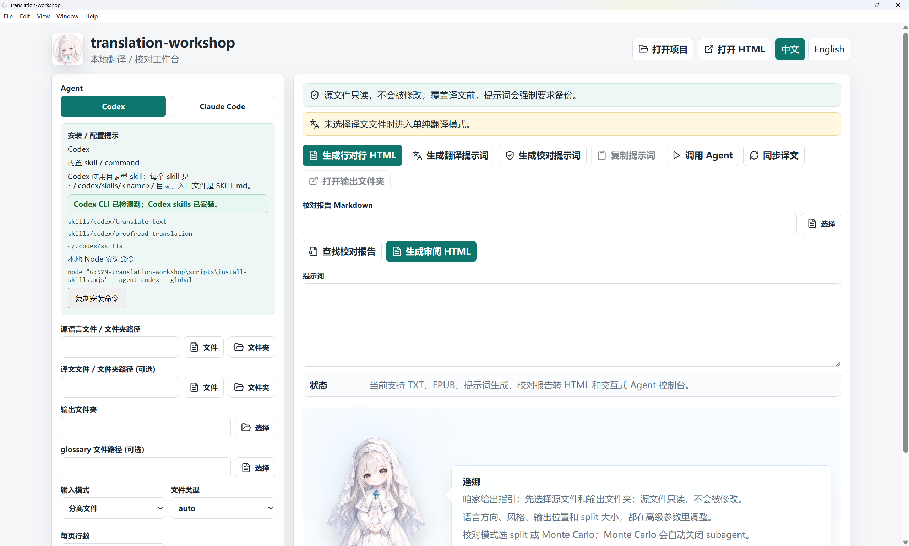
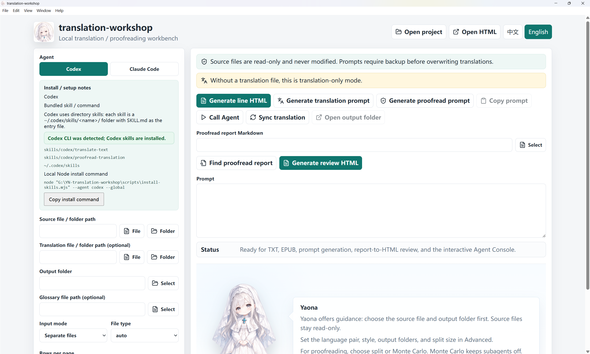
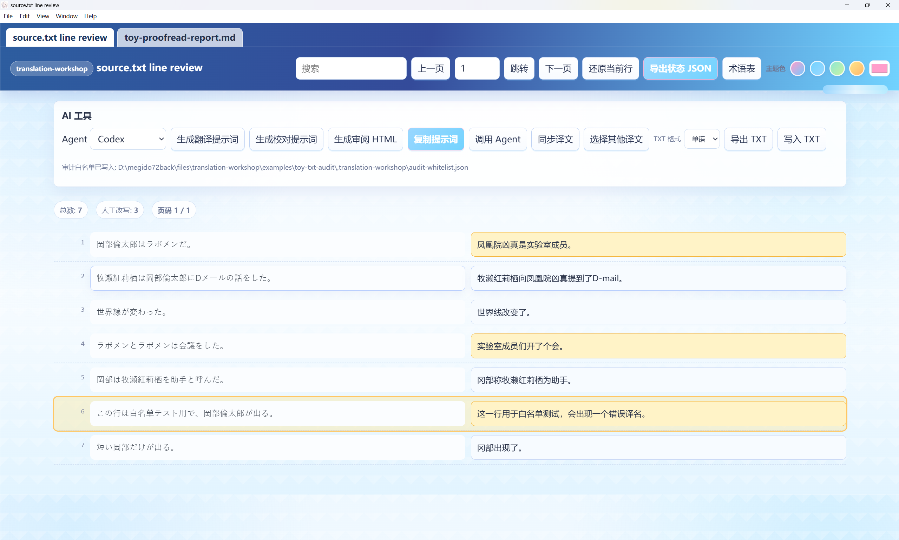
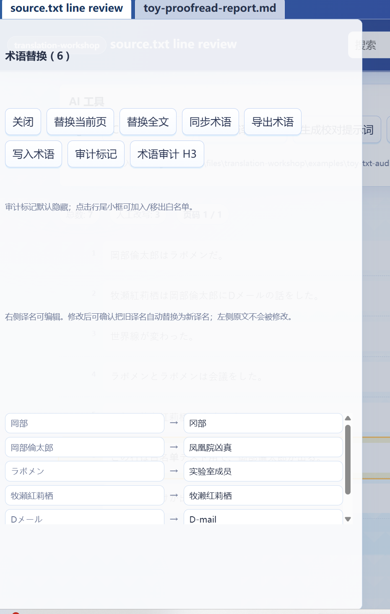
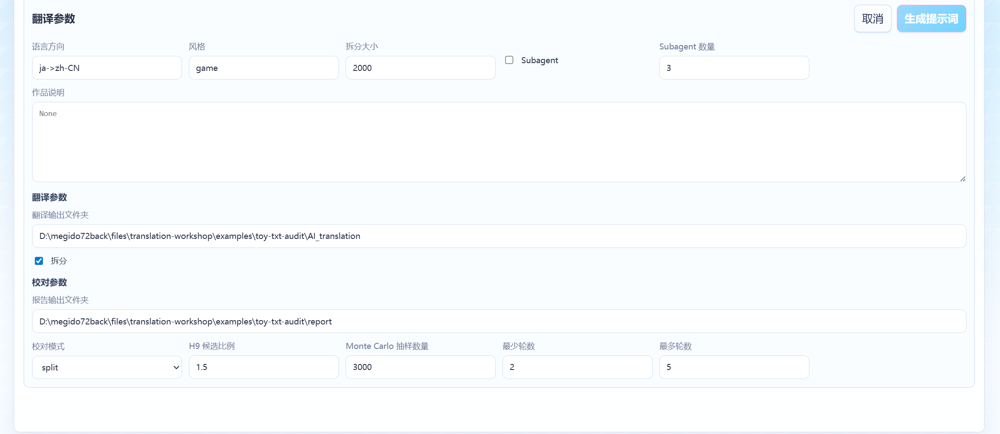
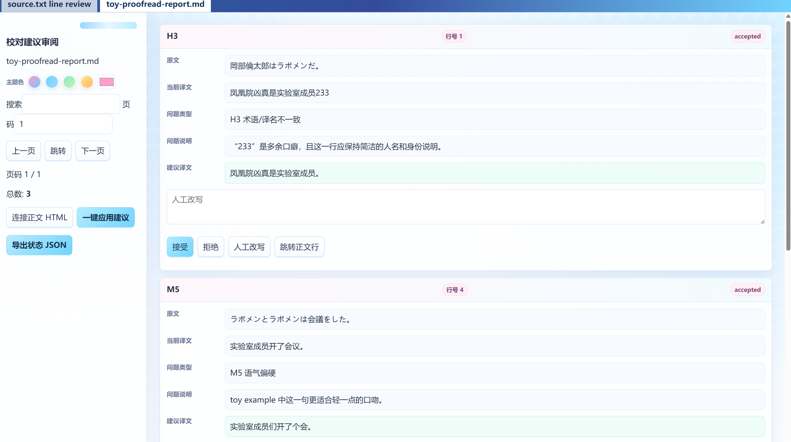
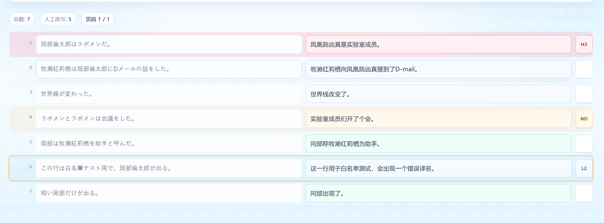

# translation-workshop

> A local translation / proofreading workbench.  
> Built for human-review-first translation workflows, with optional Codex / Claude Code Agent assistance.

[中文 README](README.md)

translation-workshop pairs source text and translated text line by line, generates editable review HTML for human revision, helps generate Codex / Claude Code translation and proofreading prompts, and converts proofreading Markdown reports into item-by-item review HTML.

The motivation is simple: many AI translation tools look powerful, but they are not friendly to real translation or fan-translation workflows. No matter how impressive AI output looks, it still needs human review before it can reach stable production quality. A comfortable, visible, and traceable frontend is a major missing piece.

This project is designed for three kinds of users:

- Translators who do not use AI: a comfortable line-by-line translation and proofreading interface.
- Translators who do use AI: Agent-assisted translation / proofreading while keeping human review in control.
- Users who do not know the source language: an AI-assisted path for translation, proofreading, and visual result review.

## Download

Recommended for Windows users:

**`translation-workshop.Setup.exe`**

If you do not want to install it, use the portable build:

**`translation-workshop.exe`**

Release page:  
<https://github.com/TohmaN233/YN-translation-workshop/releases>

## Update Info

### v1.0.5

- **Codex proofread skill**: simplified the proofreading report prompt; report prose now uses the target language, parser-required labels stay fixed in English, and fix proposal line / field constraints are stricter.
- **Prompts sent to AI**: translation and proofreading prompts both emphasize target-language output; fixed labels such as `Suggested fix` must stay unchanged.
- **Glossary UI**: enlarged the glossary panel, added search across source terms, target terms, and current translations, and switched glossary entries to dynamic rendering.
- **Fallback report repair prompt**: when a likely fix proposal cannot be parsed into review HTML, the app generates a localized repair prompt and opens the Agent panel for direct sending.

## Bundled Skills

The project bundles Codex and Claude Code versions of the skills. It currently supports Agent-based translation workflows, not direct API-only translation through prompt engineering.

- [translate-text guide](skills/translate-text.README.md): batch translation, glossary handling, and character notes.
- [proofread-translation guide](skills/proofread-translation.README.md): line-by-line proofreading, Monte Carlo sampling, and fix proposal reports.

Layout:

- Codex skill: `skills/codex/<skill-name>/SKILL.md`
- Claude Code command: `skills/claude/commands/<skill-name>.md`

## UI Preview

<p align="center">
  
  
</p>

The UI supports Chinese / English switching. The main screen includes file selection, output directory, format options, input mode, skill setup hints, and generation actions.

## Key Features

### Line-Review HTML

Select a source file, a translation file, and an output folder to generate line-review HTML. The translation file is optional; leaving it empty starts translation-only mode.

Supported:

- TXT / EPUB
- Separate-file mode
- Bilingual TXT / bilingual EPUB adjacent-line splitting
- Folder input
- Pagination, page jump, search, and scroll-position memory
- Manual-edit state marking
- Reopen to the last edited location; the yellow outline marks the last / active row

<p align="center">
  
</p>

TXT / EPUB can be exported at any time. TXT can also be written back to the bound translation file, with a timestamped backup before overwrite.

### Glossary And Replacement

You can browse the glossary while translating, edit term translations, and apply replacements to the current page or the full text.

Glossary checking also highlights terms that appear in the source but are missing from the target. Longer terms take priority over shorter contained terms. Missing glossary translations are marked as H3 and highlighted.

<p align="center">
  
</p>

### Agent Prompts And Interactive Console

Translation and proofreading both provide parameter dialogs. You can set language pair, genre, output directory, split / subagent options, and then generate the prompt.

<p align="center">
  
</p>

The app includes a real terminal console for interacting with Codex / Claude Code. Install and log in to the corresponding CLI before use.

### Proofreading Report Review HTML

After proofreading finishes, select or auto-discover the Markdown report and generate fix-proposal review HTML.

<p align="center">
  
</p>

The review HTML can be linked back to the line-review HTML:

- Mark report issues on the corresponding source rows.
- Jump back to the main review page for context.
- Accept AI-suggested translations with one click.
- Manually rewrite and mark human-handled status.

<p align="center">
  
</p>

Project state is saved under `.translation-workshop/` in the selected output folder, so the same project folder can be reopened later.

## Launch Like An App

Windows:

```bat
start-workshop.cmd
```

macOS / Linux / Git Bash:

```bash
./start-workshop.sh
```

The launch scripts install dependencies when `node_modules` is missing, build when `dist` is missing, and then open the Electron app.

## Basic Workflow

1. Choose Codex or Claude Code on first launch.
2. Check the bundled skill / command paths and install status, then copy the install command if needed.
3. Select a source TXT / EPUB file, or a source folder.
4. Optionally select a translation TXT / EPUB file, or a translation folder.
5. Select an output folder.
6. Generate line-review HTML.
7. In the HTML, translate or revise target text manually, jump pages, search, and replace glossary terms.
8. When AI translation is needed, generate a translation prompt and open the Agent Console.
9. After translation finishes, import or sync the translated TXT.
10. Generate a proofreading prompt, then copy it or send it to the interactive Agent Console.
11. After proofreading finishes, select or auto-discover the Markdown report and generate fix-proposal review HTML.
12. After review, use `Save TXT` to overwrite the bound translation TXT, or `Export TXT` to save a separate copy.

## Codex Skill Setup

Bundled paths:

- Translate: `skills/codex/translate-text`
- Proofread: `skills/codex/proofread-translation`

The app only copies the install command. It does not automatically write to your global Codex configuration. The GitHub command is recommended and works for installed, portable, and no-clone setups. It requires Node.js 18 or newer:

```powershell
irm https://raw.githubusercontent.com/TohmaN233/YN-translation-workshop/main/scripts/install-skills.mjs | node - --github --agent codex --global
```

To update existing Codex skills, add `--replace` to the same command:

```powershell
irm https://raw.githubusercontent.com/TohmaN233/YN-translation-workshop/main/scripts/install-skills.mjs | node - --github --agent codex --global --replace
```

If you have cloned the repository, you can also install from the local path:

```bash
node /path/to/translation-workshop/scripts/install-skills.mjs --agent codex --global
```

Install targets:

- `~/.codex/skills/translate-text/SKILL.md`
- `~/.codex/skills/proofread-translation/SKILL.md`

The installer skips existing skills by default. Add `--replace` only when you intentionally want to update an existing target; the old target is backed up under `~/.translation-workshop/skill-backups/` first.

## Claude Code Skill Setup

Bundled paths:

- Translate: `skills/claude/commands/translate-text.md`
- Proofread: `skills/claude/commands/proofread-translation.md`

The app only copies the install command. It does not automatically write to your global Claude Code configuration. The GitHub command is recommended and works for installed, portable, and no-clone setups. It requires Node.js 18 or newer:

```powershell
irm https://raw.githubusercontent.com/TohmaN233/YN-translation-workshop/main/scripts/install-skills.mjs | node - --github --agent claude --global
```

To update existing Claude Code commands, add `--replace` to the same command:

```powershell
irm https://raw.githubusercontent.com/TohmaN233/YN-translation-workshop/main/scripts/install-skills.mjs | node - --github --agent claude --global --replace
```

If you have cloned the repository, you can also install from the local path:

```bash
node /path/to/translation-workshop/scripts/install-skills.mjs --agent claude --global
```

Install targets:

- `~/.claude/commands/translate-text.md`
- `~/.claude/commands/proofread-translation.md`

The installer skips existing commands by default. Add `--replace` only when you intentionally want to update an existing target; the old target is backed up under `~/.translation-workshop/skill-backups/` first.

## File Support

| Format | Current support |
| --- | --- |
| TXT | Line-review HTML, write back, export |
| EPUB | Text extraction into line-review HTML |
| Bilingual TXT | Adjacent-line source / translation position splitting |
| Bilingual EPUB | Adjacent-line source / translation position splitting |
| Glossary | JSON, tab-delimited, `=>`, `->`, `=`, and comma-separated pairs |
| Markdown report | Report discovery and review HTML |

## Safety Notes

- Source files are read-only and never modified.
- The app does not automatically install global Codex / Claude Code skills. It only performs read-only detection and copies install commands.
- The installer skips existing global targets by default.
- `--replace` backs up the exact target before updating it.
- `Save TXT` writes to the bound translation path only when the HTML is opened from the Electron app.
- The Agent Console is a real interactive terminal. The app does not run hidden background jobs or pretend to know completion. Sync translations or discover reports manually after the agent finishes.

## Acknowledgements

Special thanks to OpenAI Codex for all the help with engineering and design. As a great person once said, a project is made of 99% tokens and 1% inspiration.

## Advanced: Monte Carlo Stress-Test Prompt

<details>
<summary>Expand prompt template</summary>

```text
You are a Translation Project Manager. please ask 3 (or any number, larger is harder to pass the test) sub-agents to do the following job, start at different seeds.

Please use the proofread-translation skill to run a Monte Carlo translation-quality stress test on the following source/translation pair.

Goal:
- Check whether a large translation still contains serious translation-quality issues.
- Focus only on true actionable issues found in sampled lines; every candidate must be manually judged.
- Do not repeat global scans, old-report comparisons, or full terminology audits that have already been completed, unless I explicitly ask for them.

Inputs:
- Review mode: montecarlo
- Type: {game/novel/technical/subtitle/academic}
- Source language: {SOURCE_LANGUAGE}
- Target language: {TARGET_LANGUAGE}
- Source file: {SOURCE_FILE}
- Translation file: {TRANSLATION_FILE}
- Glossary file, optional: {GLOSSARY_FILE}
- Sample size per round: {SAMPLE_SIZE, default 5000}
- Confirmed-issue line exclusion set: {KNOWN_ISSUE_LINES, may be empty}

Scope for this stress test:
- Focus on HIGH translation-quality risks: mistranslation, misaligned line, omission, empty translation, severe over-translation/line bleed, AI/reviewer meta-language contamination, source-language residue, number/list-index errors, lost or translated code placeholders/tags, abnormal expansion, and hallucination.
- If an H9 expansion/hallucination issue is found in the sample, retranslate the full source line and provide that full replacement as the suggested translation.

Output requirements:
- Every issue must include: global line number, source text, current translation, issue explanation, severity, and a complete directly replaceable suggested translation.
- Every severity level (HIGH/MEDIUM/LOW) must include a complete suggested translation. Do not provide only a direction, a partial replacement, or meta wording such as "suggest changing to".
- The suggested translation field must contain only the final replacement text itself.
- If a candidate is a false positive, explain why and continue; it does not count as a failure.
- If a sampled line is in the confirmed-issue exclusion set, mark it as a known issue and exclude it; it does not count as a failure.

Convergence rule:
- Start counting from the translation state after the most recent applied fix.
- If a new true issue is found: report the full suggested translation and stop. The manager will apply the fix, then convergence counting must restart.
- If no new true issue is found, continue with a different seed.
- This lane converges after {CLEAN_ROUNDS, default 2} consecutive different seeds produce no new true issues.
- Multiple agents run in parallel, every lane must independently satisfy this convergence rule. O.W., all agent should do a totally new round after fixes of manager.

Environment note:
- On Windows PowerShell, force UTF-8 output before reading files or running scripts:
  [Console]::OutputEncoding=[System.Text.UTF8Encoding]::new()
- If Python is used, set:
  $env:PYTHONUTF8='1'
  $env:PYTHONIOENCODING='utf-8'

Final response:
- List the seeds used.
- State whether convergence was reached.
- List any new true issues found.
- Summarize false-positive candidates.
- List excluded known-issue lines.
```

</details>
