# 翻译工具使用教程

## 安装 Skill

以 codex 为例。打开 PowerShell，没有对应 CLI 就先安装：

```
npm install -g @openai/codex
```

复制粘贴回车，会自动安装。

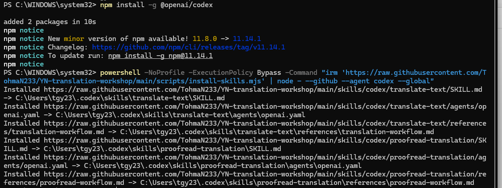

---

## 从零翻译一个项目

我拿一本免费轻小说《东京ESP 外传》做例子。

选好文件和目录之后，点击「生成行对行 HTML」，生成前端网页，开始工作。这里如果有术语表（glossary）最好一并上传。

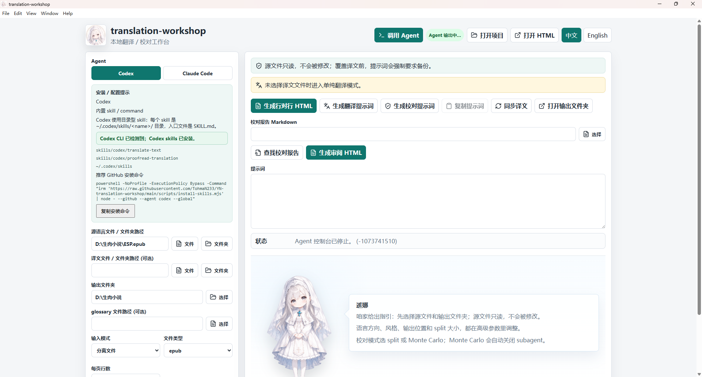

---

## 手动翻译

如果是不想借助 AI 的老派翻译，就可以像我这样一行行打字。TAB 可以快速切行。

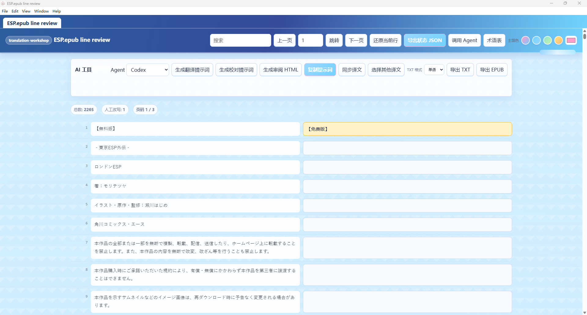

---

## AI 翻译

点击上方的「生成翻译提示词」，选择你电脑的 agent，按「生成提示词」。

> **Subagent** 就是和你聊天的模型当中间管理层，再叫几个小弟干活。通常耗费 token 更多，但快。

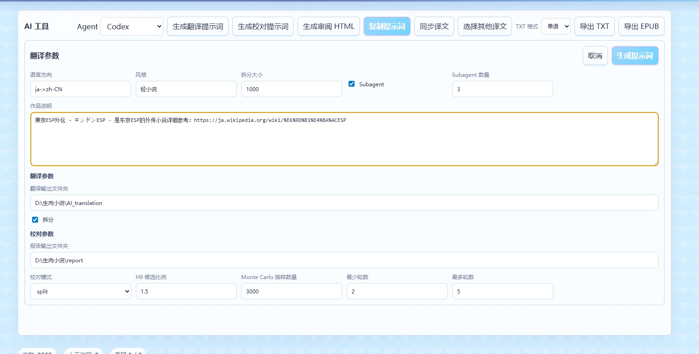

我用 Claude Code 为例：先把模型切到 4.6，因为翻译写作上我觉得 4.6 比 4.7 好。（使用 agent 翻译很费 token 请做好心理准备；一本小说还好，翻译メギド72 那个千万字以上的手游确实有点地狱了。）

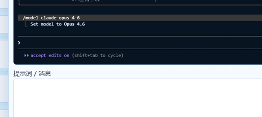

发送提示词后：

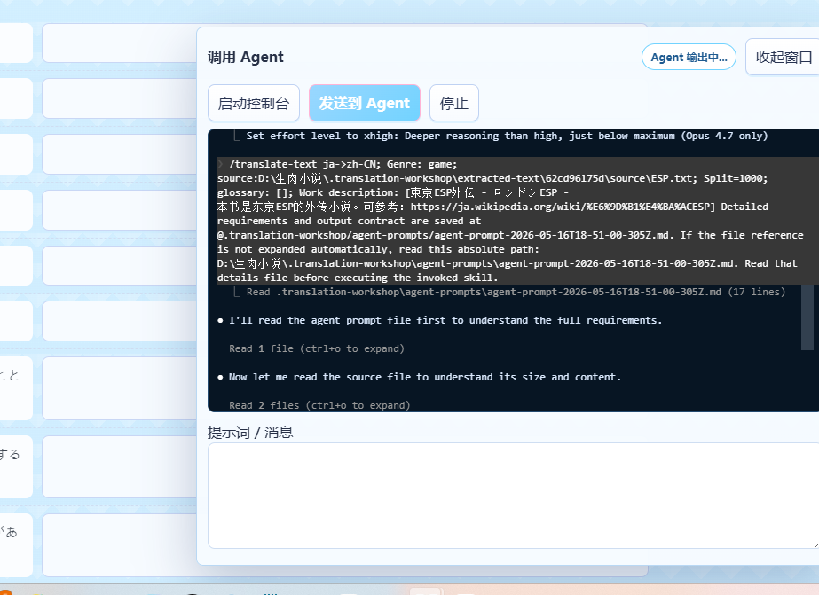

Agent 就会开始干活了，中间会问几个权限是否同意，通常同意就好。

---

## 预处理：角色圣经 & 术语表

翻译 skill 正常工作的话，作为 pre-processing 会先生成一个**角色圣经**。（这是我之前做写小说 skill 的思路：[auto-novel-creator](https://github.com/TohmaN233/auto-novel-creator)）

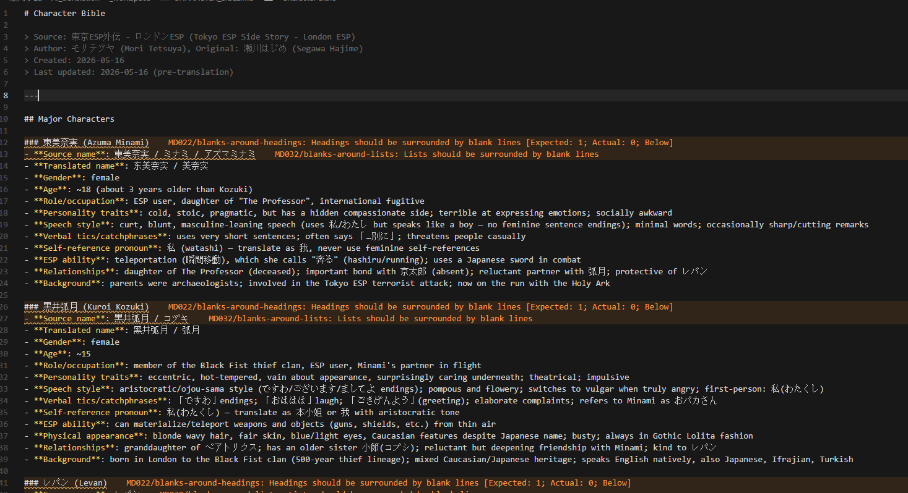

里面会写上每个主要角色的特点和性格，保证翻译时的一致性。

以及一个**术语表**：

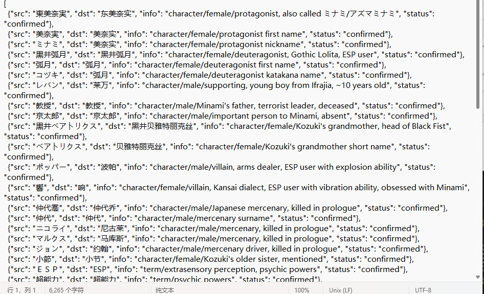

---

## 等待翻译完成

我的例子里这本小说用 Claude Opus 4.6 派了 3 个子 agent，花了差不多 20 分钟完成初翻。

翻译最终合并结果在 `AI_translation`；临时文件都可以在 `_workspace` 下看到。

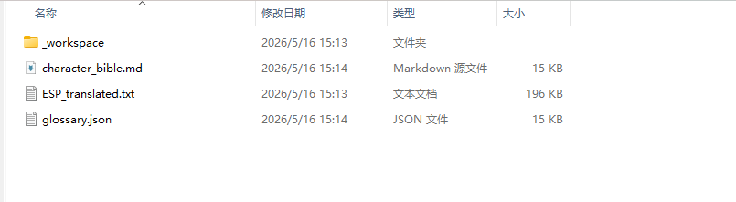

---

## 导入前端 HTML

接下来把完成的文件导入前端 html，比如术语表和翻译文件。

上方「选择其他译文」就是导入文本按钮。术语表那几个操作顾名思义：

| 按钮 | 功能 |
|------|------|
| 导入 | 导入文件 |
| 同步 | 把本地修改同步到 html |
| 写入 | 把 html 修改同步到本地 |
| 导出 | 另存 |

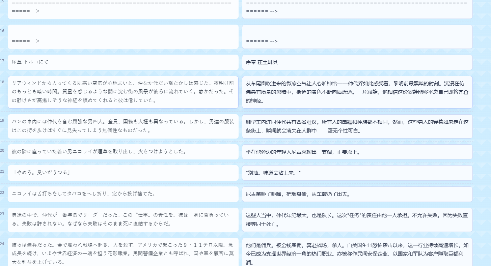

---

## 术语审计

术语表导入后，**术语审计**会自动标红所有「日文名词出现但中文名词没出现」的地方，方便审核。

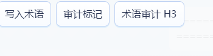

当然会有误判，比如：


「响」这个字既是人名也是常见词，所以就误判了。这时点一下就能加入白名单。

---

## AI 校对

步骤和前面的翻译基本一致。

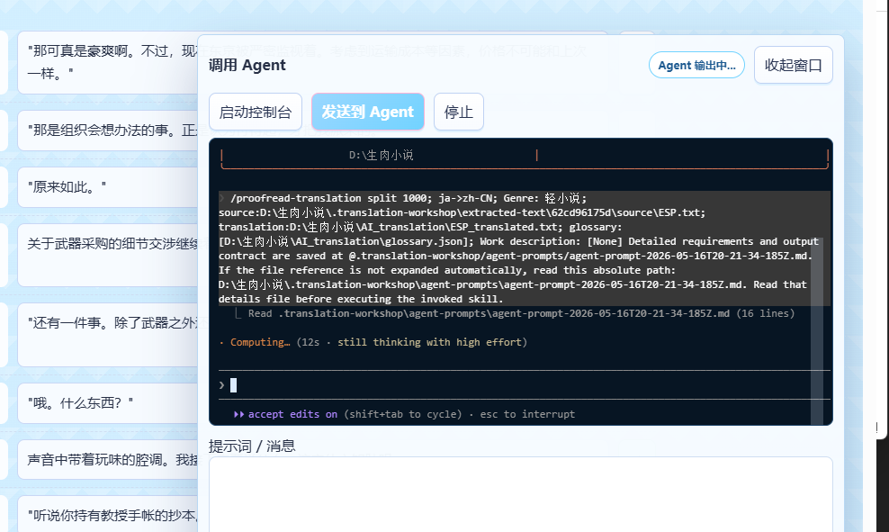

差不多十几分钟后审完。这时会生成两个主要文件：

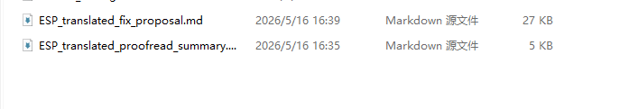

小文件是总结报告，大的是主要文件，包含 AI 对错误的解读和建议译文。点击对应按钮：


就会自动得到这样的报告：

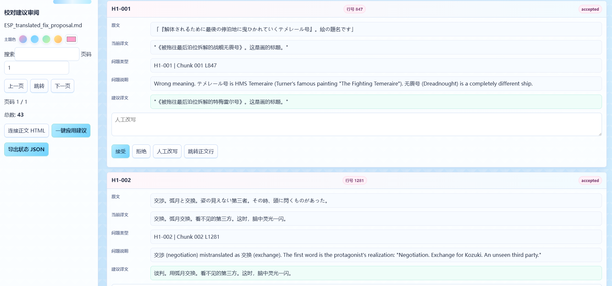

然后就是人工时间，一个个判断 AI 说的有没有道理，选择接受、跳过或者自己翻译。有歧义的句子可以跳转上下文自己判断，且可以直接绑定正文，在正文高亮有问题的句子。

另外，虽然提示词说了建议要写译文，有时 AI 还是会在那边左右脑互博，比如：

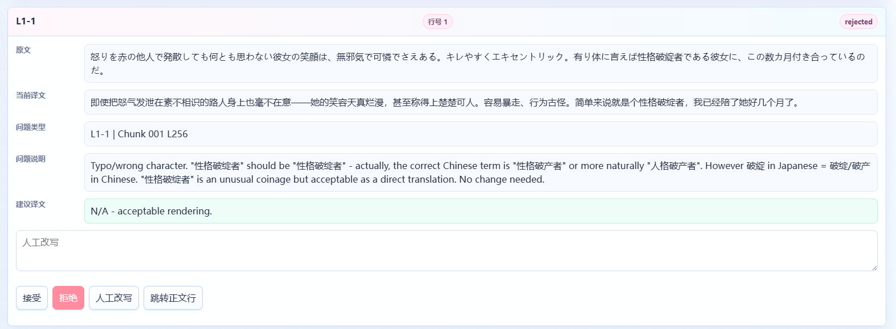

所以**建议至少看一眼，别无脑替换**。

全部审完之后，按下「一键替换」就能将对应句子替换成 AI 修改的或者你人工修改的版本。

---

## 进阶：Monte Carlo 抽样检查

如果想检查得更仔细，可以尝试再用 Monte Carlo 抽样检查，参考 GitHub 仓库 README 最后的压力测试提示词。

当然，要确保质量的话强烈建议还是人工全文审阅一遍。但即便如此，使用本工具的 AI 校对功能也能极大提高工作效率。

---

## 导出

觉得质量可以了？点击上方的**导出**就好。

---

## 示例成品

本教程产出的翻译小说（未经本人校对，纯 AI 翻译 + 一轮 AI 校对），供各位对纯 AI 翻译目前水平心里有个底：

链接：https://pan.baidu.com/s/11s7HlsUD8GvKZmtF4H0Yfg  
提取码：esp2
